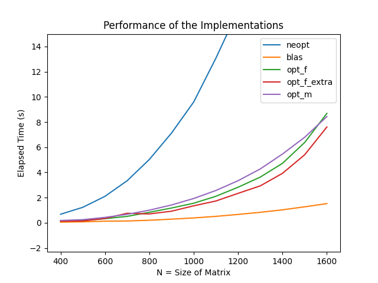

# Tema 2 - Optimizarea inmultirilor de matrice
**Conventie:** Se va folosi simbolul din _Matlab/Octave_ pentru o matrice
transpusa (`'`), pentru claritate si simplitate.

Se implementeaza operatia `B * A' + A^2 * B` cu diverse optimizari si se compara
performantele.

Pentru a se masura mai bine performantele, s-au adaugat alte 10 inputuri in
fisierul `input_extended`, care a fost folosit pentru masuratori

## Optimizari generale ale algoritmului de inmultire de matrice
Dat fiind ca matricea `A` este superior triunghiulara, indicii dupa care se va
parcurge aceasta matrice au valori initiale si finale modificate, pentru a nu
efectua operatii inutile (inmultiri cu `0`). Aceste optimizari sunt aplicate
atat in varianta `opt_m`, cat si in cea `neopt` a rezolvarii.

### BA_t = B * A'
In primul rand, nu are sens transpunerea lui `A`. Parcurgerea coloanelor lui
`A'` este echivalenta cu parcurgerea liniilor lui `A`, in cadrul careia, pe
deasupra, vor avea loc mai multe cache hituri datorita localitatii spatiale a
datelor. Astfel, `B * A'` va deveni `B * A`, in care `A` se parcurge pe linii,
notat de acum ca `B * A(pe linii)`

In al doilea rand, pentru a calcula `BA_t[i][j]`, nu este necesara calcularea
intregii sume a produselor elementelor de pe linia `i` a lui `B` cu elementele
de pe linia `j` a lui `A`, deoarece primele `j - 1` elemente ale acesteia din
urma sunt `0`. Este de ajuns sa se efectueze operatia pentru elementele de pe
linia `j` a lui `A`, incepand de la coloana j.

## AA = A^2
Produsul a doua matrice simetrice este tot o matrice simetrica. Asadar, nu ne
intereseaza decat elementele `AA[i][j]`, cu `j >= i`. In mod similar optimizarii
de la inmultirea `B * A'`, suma de produse dintre elementele de pe linii si de
pe coloane ale matricei va incepe de la indicele `i`, nu de la `0`.

## AAB = A^2 * B = AA * B
Matricea `AA` a fost explicata mai sus. Optimizarea de indici in cadrul
calcularii `AAB[i][j]` se foloseste tot de faptul ca `AA` este superior
triunghiulara si este foarte similara celei folosite pentru calcularea unui
element din `BA_t[i][j]`: suma va incepe de la coloana `i`, intrucat
`AA[i][j] = 0`, pentru `j < i`.

## neopt
Metoda aplica optimizarile generala de mai sus, care tin cont in mare parte doar
de forma matricei `A` si obtine urmatoarele performante:
```
Run=./tema2_neopt: N=400: Time=0.679213
Run=./tema2_neopt: N=500: Time=1.227661
Run=./tema2_neopt: N=600: Time=2.100510
Run=./tema2_neopt: N=700: Time=3.340235
Run=./tema2_neopt: N=800: Time=5.029776
Run=./tema2_neopt: N=900: Time=7.129861
Run=./tema2_neopt: N=1000: Time=9.598484
Run=./tema2_neopt: N=1100: Time=13.080262
Run=./tema2_neopt: N=1200: Time=16.871584
Run=./tema2_neopt: N=1300: Time=21.938412
Run=./tema2_neopt: N=1400: Time=27.602604
Run=./tema2_neopt: N=1500: Time=35.962009
Run=./tema2_neopt: N=1600: Time=47.229889
```

## opt_blas
De departe cea mai spectaculoasa si surprinzatoare metoda (fapt evidentiat de
timpii de rulare extrem de mici), implementarea se bazeaza pe optimizarile pe
care biblioteca _BLAS_ le face la nivelul functiei sale, `cblas_dtrmm()`[0],
care inmulteste o matrice triunghiulara (`A` in cazul de fata) cu un scalar (`1`
in acest caz) si apoi inmulteste rezultatul cu alta matrice (`B` sau `A`). Dupa
ce se calculeaza `B * A'` si `A^2 * B`, aceste rezultate sunt adunate "de mana",
intrucat _BLAS_ nu pune la dispozitie o functie care face acest lucru :(.

In consecinta, timpii obtinuti cu aceasta metoda sunt:
```
Run=./tema2_blas: N=400: Time=0.048393
Run=./tema2_blas: N=500: Time=0.076522
Run=./tema2_blas: N=600: Time=0.127462
Run=./tema2_blas: N=700: Time=0.142127
Run=./tema2_blas: N=800: Time=0.201365
Run=./tema2_blas: N=900: Time=0.288280
Run=./tema2_blas: N=1000: Time=0.385960
Run=./tema2_blas: N=1100: Time=0.510406
Run=./tema2_blas: N=1200: Time=0.663962
Run=./tema2_blas: N=1300: Time=0.831795
Run=./tema2_blas: N=1400: Time=1.029079
Run=./tema2_blas: N=1500: Time=1.268744
Run=./tema2_blas: N=1600: Time=1.523858
```
**Mentiune:** pe cat de performanta este biblioteca, pe atat de neintuitiva este
conventia de nume pe care o foloseste. Mi-a luat ceva sa ma prind ca `dtrmm`
provine de la **d**ouble **tr**iangular **m**atrix **m**ultiply...

## opt_f
Aceasta implementare este cea neoptimizata, compilata cu flagul `-O3`. Pentru
comparatie cu `opt_f_extra`, am notat timpii acestei metode:
```
Run=./tema2_opt_f: N=400: Time=0.146516
Run=./tema2_opt_f: N=500: Time=0.180828
Run=./tema2_opt_f: N=600: Time=0.325335
Run=./tema2_opt_f: N=700: Time=0.509183
Run=./tema2_opt_f: N=800: Time=0.832792
Run=./tema2_opt_f: N=900: Time=1.172873
Run=./tema2_opt_f: N=1000: Time=1.552784
Run=./tema2_opt_f: N=1100: Time=2.106394
Run=./tema2_opt_f: N=1200: Time=2.826088
Run=./tema2_opt_f: N=1300: Time=3.630285
Run=./tema2_opt_f: N=1400: Time=4.723751
Run=./tema2_opt_f: N=1500: Time=6.380574
Run=./tema2_opt_f: N=1600: Time=8.688950
```

## opt_f_extra
Am plecat de la flagul `-ffast-math`. Folosind documentatoa gcc-ului[1],[2], am
"descompus" aceast flag in flagurile pe care le activeaza. Dintre acestea, le-am
ales pe acelea care influenteaza problema curenta:

### -fno-signed-zeros
Conform standardului _IEEE_, exista `-0.0` si `+0.0` si se comporta diferit in
calcule. Daca se adauga acest flag, semnul lui `0.0` nu mai este relevant, iar
pentru problema noastra, nu este relevant.

### -ffinite-math-only
Presupune ca nu se vor face operatii cu valori `NaN` si/sau `+/-Inf` si permite
optimizarea acestora in consecinta. Cum aceste valori nu se vor intalni printre
rezultatele obtinute (se garanteaza ca datele sunt corecte), se poate face
optimizarea.

### -fno-signaling-nans -fno-trapping-math
Intrucat nu se fac operatii de impartire, iar datele sunt valide, nu ne
intereseaza erorile, iar aceste flaguri fac ca aceste erori sa nu mai fie luate
in considerare, eliminand astfel overheadul necesar verificarilor.

### -fassociative-math
Se permite reordonarea calculelor si a operanzilor in vederea imbunatatirii
timpului de executie.

### -fexcess-precision=fast
Aceasta optimizare permite efectuarea calculelor intr-o precizie mai mare decat
cea a datelor insesi, daca acest lucru duce la o performanta marita.

### -mfpmath=sse
Intrucat procesorul pe care se ruleaza este pe 64 de biti, acest flag activeaza
extensia SSE si face procesorul sa efectueze calculele folosind aceste
instructiuni noi (_Streaming SIMD Extensionss_) pentru calculele in virgula
mobila. Aceasta extensie este utila pentru problema curenta, deoarece operatia
de inmultire de matrice se preteaza unor sisteme (sau extensii) SIMD.

Prin urmare, timpul obtinut in urma compilarii cu aceste flaguri este, pentru
`N = 1200`, **cu aproximativ 16% mai bun** decat cel obtinut doar cu flagul
`-O3`:
```
Run=./tema2_opt_f_extra: N=400: Time=0.132148
Run=./tema2_opt_f_extra: N=500: Time=0.142979
Run=./tema2_opt_f_extra: N=600: Time=0.341052
Run=./tema2_opt_f_extra: N=700: Time=0.755240
Run=./tema2_opt_f_extra: N=800: Time=0.702910
Run=./tema2_opt_f_extra: N=900: Time=0.920976
Run=./tema2_opt_f_extra: N=1000: Time=1.348005
Run=./tema2_opt_f_extra: N=1100: Time=1.731644
Run=./tema2_opt_f_extra: N=1200: Time=2.339153
Run=./tema2_opt_f_extra: N=1300: Time=2.933369
Run=./tema2_opt_f_extra: N=1400: Time=3.930340
Run=./tema2_opt_f_extra: N=1500: Time=5.403199
Run=./tema2_opt_f_extra: N=1600: Time=7.610432
```

## opt_m
S-au folosit 3 tipuri de optimizari.

### Obtinerea localitatii spatiale
In cadrul algoritmului clasic de inmultire de matrice, operantul din dreapta
este parcurs pe coloane, ceea ce nu confera algoritmului localitate spatiala,
ceea ce va rezulta intr-un numar mare de cache missuri. Solutia, asa cum am
mentionat si la inceputul README-ului, este sa transpunem matricea din dreapta
si sa o parcurgem pe linii. Acest lucru s-a facut pentru inmultirile
`B * A' <=> B * A(pe linii)`, `A* A <=> A * A'(pe linii)` si
`A^2 * B <=> A^2 * B'(pe linii)`.

### Eliminarea constantelor din bucle
In mod similar implementarilor din _Laboratorul 5_[3], s-a renuntat la calculul
indecsilor de tipul `i * N + j` prin folosirea pointerilor, care sunt
incrementati pentru fiecare pozitie din matrice sau pentru fiecare termen din
suma, astfel scazand numarul total de operatii (nu in virgula mobila) facute de
procesor, care acum nu mai trebuie sa inmulteasca `i * N` atunci cand nu este
nevoie.

Aceasta procedura s-a aplicat tuturor celor 3 inmultiri de matrice (`B * A'`,
`A * A` si `(A * A) * B`), cat si pentru operatiile de transpunere a matricelor
`A` si `B` descrise mai sus.

### Folosirea registrelor procesorului
Toate datele necesare unei inmultiri de matrice (indicii pentru pozitiile din
matrice ale operanzilor, pointerii mentionati mai sus) sunt retinute direct in
registrele procesorului (folosind tipuri de date `register <tip>`) pentru a se
elimina overheadurile de acces la memorie (fie ea si cache) pentru aceste
variabile. Intrucat sistemul de pe _ibm-nehalem.q_ este pe 64 de biti, numarul
de registre este suficient de mare pentru a nu aparea intarzieri din cauza
comutarilor intre acestea.

Astfel, se obtin urmatorii timpi de executie:
```
Run=./tema2_opt_m: N=400: Time=0.183190
Run=./tema2_opt_m: N=500: Time=0.248208
Run=./tema2_opt_m: N=600: Time=0.427608
Run=./tema2_opt_m: N=700: Time=0.671219
Run=./tema2_opt_m: N=800: Time=1.001230
Run=./tema2_opt_m: N=900: Time=1.413819
Run=./tema2_opt_m: N=1000: Time=1.931140
Run=./tema2_opt_m: N=1100: Time=2.565698
Run=./tema2_opt_m: N=1200: Time=3.345301
Run=./tema2_opt_m: N=1300: Time=4.279649
Run=./tema2_opt_m: N=1400: Time=5.463564
Run=./tema2_opt_m: N=1500: Time=6.794032
Run=./tema2_opt_m: N=1600: Time=8.437422
```
## Grafice
Graficele timpilor de executie in functie de `N` se pot observa ruland scriptul
`plot_graphics.py` astfel:
```bash
$ python3 plot_graphics.py
```

Datele plotate sunt incarcate de script din fisierul
`ibm-nehalem.q_runtimes.json`, care contine timpii din acest _README_. De
asemenea, plotul ce contine graficele se afla salvat in fisierul
`performance_graphics.png`:


## Comparatii si concluzii
Analizand graficele create de scriptul de mai sus, precum si timpii mentionati
la fiecare exercitiu, putem face urmatoarele observatii pe baza performantelor
obtinute pentru `1200 <= N <= 1600`:
- `opt_m` este, in medie, cu **84,69%** mai rapid decat `neopt`
- `opt_f_extra` este, in medie, cu **16,19%** mai rapid decat `opt_f`
- `blas` este, in medie, cu **74,71%** mai rapid decat `opt_f_extra`

Din graficele de mai sus se remarca performantele similare, dar totusi cu
diferente sesizabile intre ele ale metodelor `opt_m`, `opt_f`, `opt_f_extra`,
intrucat acestea se bazeaza mai mult sau mai putin pe aceeasi idee de
implementare. De asemenea se remarca faptul ca pentru valori mari ale lui `N`
(`1500`, `1600`), performantele metodei `opt_m` ajung sa se apropie si chiar sa
le depaseasca pe cele ale metodei `opt_f`.

Graficul metodei `blas`, in schimb, este aproape o dreapta :)).

## Bibliografie
- [0] https://developer.apple.com/documentation/accelerate/1513132-cblas_dtrmm?language=objc
- [1] https://gcc.gnu.org/onlinedocs/gcc/Optimize-Options.html
- [2] https://linux.die.net/man/1/gcc
- [3] https://ocw.cs.pub.ro/courses/asc/laboratoare/05#detectarea_constantelor_din_bucle
